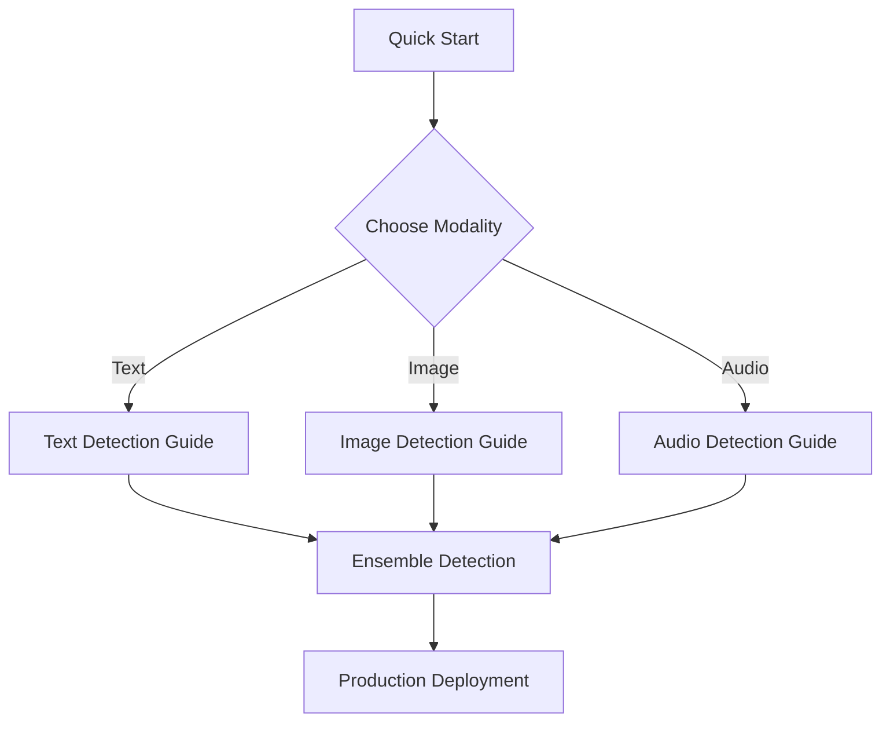

# Tutorials

Welcome to the Veridex tutorials! These guides will help you master AI content detection across all modalities.

---

## 🎯 Learning Path

Follow these tutorials in order for the best learning experience:

---

## Available Tutorials

### 🚀 Getting Started

-   [**Quick Start (5 minutes)**](quick_start.md)

    Get up and running with Veridex in under 5 minutes. Perfect for first-time users.

    **You'll learn:**

    - How to install Veridex
    - Run your first detection
    - Interpret results

    Beginner 5 min

---

### 📝 Text Detection

-   [**Text Detection Guide**](text_detection_guide.md)

    Learn to detect AI-generated text using various signals and techniques.

    **You'll learn:**

    - Choosing the right text detector
    - Understanding perplexity and burstiness
    - Using Binoculars for high accuracy
    - Interpreting linguistic signals

    Beginner-Intermediate 15 min

---

### 🖼️ Image Detection

-   [**Image Detection Guide**](image_detection_guide.md)

    Master image deepfake detection with frequency analysis and diffusion techniques.

    **You'll learn:**

    - Image preprocessing best practices
    - Frequency domain analysis
    - Using DIRE for diffusion artifacts
    - Error Level Analysis (ELA)
    - GPU vs CPU considerations

    Intermediate 20 min

---

### 🎵 Audio Detection

-   [**Audio Detection Guide**](audio_detection_guide.md)

    Detect synthetic voice and deepfake audio using spectral and foundation model approaches.

    **You'll learn:**

    - Audio format requirements
    - Spectral analysis for quick screening
    - AASIST for anti-spoofing
    - Wav2Vec for production-grade detection
    - Silence pattern analysis

    Intermediate 20 min

---

### 🎯 Advanced Topics

-   [**Ensemble Detection**](ensemble_detection.md)

    Combine multiple signals for robust, production-ready detection.

    **You'll learn:**

    - Fusion strategies for multiple signals
    - Building custom detection pipelines
    - Confidence calibration
    - Production deployment patterns

    Advanced 25 min

---

## 💡 Tutorial Tips

!!! tip "Best Practices"
    - **Start with Quick Start** - Get familiar with the basics first
    - **Run the code** - All examples are tested and working
    - **Experiment** - Try different parameters and inputs
    - **Read the concepts** - Understanding the theory helps with practical application

!!! warning "Prerequisites"
    - Python 3.9 or higher
    - Basic understanding of Python
    - Optional: Familiarity with machine learning concepts

---

## 📚 Additional Resources

After completing the tutorials, check out:

- [Concepts Documentation](../concepts/index.md) - Deep dive into the architecture
- [API Reference](../api/core.md) - Complete API documentation
- [Use Cases](../use_cases.md) - Real-world applications
- [FAQ](../faq.md) - Common questions and answers

---

## 🆘 Need Help?

If you get stuck:

1. Check the [Troubleshooting Guide](../troubleshooting.md)
2. Review the [FAQ](../faq.md)
3. Search [GitHub Issues](https://github.com/ADITYAMAHAKALI/veridex/issues)
4. Ask in [GitHub Discussions](https://github.com/ADITYAMAHAKALI/veridex/discussions)

---

## Next Steps

[**Ready to Start? Begin with the Quick Start Tutorial →**](quick_start.md){ .md-button .md-button--primary }
