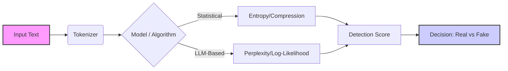

# Unmasking AI Text: Entropy, Perplexity, and Binoculars


> [!NOTE]
> **Prerequisites:** To run the code in this guide, install the necessary dependencies:
> ```bash
> pip install veridex[text]
> ```

In the age of Large Language Models (LLMs), distinguishing between human-written and machine-generated text has become a critical challenge. Whether for academic integrity, content moderation, or verifying news sources, we need reliable ways to detect "synthetic" text.

This post explores the core techniques behind AI text detection and how **Veridex** implements them in a modular, easy-to-use library.

## The Theory: Statistical Fingerprints

LLMs like GPT-4 are essentially probability machines. They predict the next token in a sequence based on training data ($P(w_i | w_{1...i-1})$). As a result, they tend to choose "safe," high-probability words to maximize coherency.

Humans, on the other hand, are chaotic. We use unexpected words, vary our sentence structures, and introduce "bursts" of complexity. This difference is what we exploit.

### Detection Pipeline

The general flow of a text detector in Veridex works like this:



## 1. Entropy and Compression

One of the simplest ways to detect AI text is through **compression**. The idea is rooted in information theory.
**Entropy** measures the unpredictability of information.
*   **AI Text:** Highly predictable $\rightarrow$ Low Entropy $\rightarrow$ High Compression Ratio.
*   **Human Text:** Unpredictable $\rightarrow$ High Entropy $\rightarrow$ Low Compression Ratio.

**Veridex** implements this via the `ZlibEntropySignal`. It calculates the compression ratio ($Size_{compressed} / Size_{original}$).

```python
from veridex.text import ZlibEntropySignal

detector = ZlibEntropySignal()
result = detector.detect("This is a very predictable sentence that an AI might write.")
print(f"AI Probability (Low Entropy): {result.score}")
```

## 2. Perplexity and Burstiness

**Perplexity (PPL)** is the standard metric for evaluating language models. It measures how "surprised" a model is by a piece of text.

$$ PPL(W) = \exp \left( - \frac{1}{N} \sum_{i=1}^N \log P(w_i | w_{<i}) \right) $$

- **Low Perplexity:** The model is not surprised (likely AI).
- **High Perplexity:** The model is surprised (likely Human).

However, perplexity alone isn't enough. Humans can write simple, low-perplexity sentences too (e.g., "The cat sat on the mat."). This is where **Burstiness** comes in. It measures the *variation* in perplexity across sentences.

*   **Humans:** High Burstiness (mix of simple and complex sentences).
*   **AI:** Low Burstiness (consistent complexity).

**Veridex**'s `PerplexitySignal` (using GPT-2 or other models) computes both:

```python
from veridex.text import PerplexitySignal

# Uses GPT-2 Large by default to measure PPL
detector = PerplexitySignal()
result = detector.detect("The quick brown fox jumps over the lazy dog.")

print(f"Score: {result.score}")
print(f"Metadata: {result.metadata}")
# Metadata contains 'perplexity' and 'burstiness'
```

## 3. Advanced Detection: Binoculars

For more robust detection, we look at **contrastive perplexity**. The "Binoculars" method (Hans et al.) compares two different perplexity scores to distinguish AI from human text more accurately than raw perplexity.

It essentially looks at the text through two different "lenses":
1.  **Observer Model:** How "human-like" does it look?
2.  **Performer Model:** How "AI-like" does it look?

The difference between these scores reveals the origin.

**Veridex** provides this state-of-the-art method in `BinocularsSignal`:

```python
from veridex.text import BinocularsSignal

# Requires downloading model weights (handled automatically)
detector = BinocularsSignal()
result = detector.detect("A complex paragraph generated by an LLM...")

print(f"Is AI? {result.score > 0.5}")
```

## 4. Stylometric Analysis

Sometimes, we don't need a massive neural network to find AI text. Simple statistics can reveal a lot. **Stylometry** analyzes the "style" of the text, looking at features like:

-   **Type-Token Ratio (TTR):** The ratio of unique words to total words. AI text is often repetitive and uses a narrower vocabulary.
-   **Average Sentence Length:** AI models tend to produce sentences of very uniform length.

**Veridex** includes `StylometricSignal` for this lightweight analysis:

```python
from veridex.text import StylometricSignal

detector = StylometricSignal()
result = detector.detect("Data. Data. Data.")
print(f"Stylometry Score: {result.score}")
# High score implies low TTR (repetitive)
```

## Why Veridex?

Veridex unifies these disparate methods into a single API. You don't need to juggle different libraries or complex setups.

- **Modular:** Use only what you need (e.g., `pip install veridex[text]`).
- **Standardized:** All signals return a consistent `DetectionResult` object.
- **Extensible:** Easily add your own signals.

## Next Steps

Ready to try it out? Check out the [Text Detection Notebook](../../examples/notebooks/text_detection_deep_dive.ipynb) for a hands-on tutorial.
