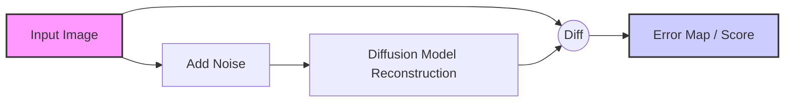

# Seeing Through the Noise: Detecting AI Images


> [!NOTE]
> **Prerequisites:** To run the code in this guide, install the necessary dependencies:
> ```bash
> pip install veridex[image]
> ```

As AI image generators like Midjourney, DALL-E 3, and Stable Diffusion become more photorealistic, distinguishing them from real photos is becoming increasingly difficult. However, these models leave behind invisible artifacts—mathematical traces of their generation process.

This post explains how **Veridex** helps you uncover these hidden signals.

## 1. Frequency Analysis: The Invisible Spectrum

When you look at an image, you see pixels (spatial domain). But computers can also look at an image in the **frequency domain**.

Real cameras capture light in a way that produces specific frequency distributions (1/f statistics). AI models, particularly those based on Convolutional Neural Networks (CNNs) or Diffusion processes, often struggle to reproduce these natural statistics perfectly. They may introduce "checkerboard artifacts" or unusual spikes in the frequency spectrum due to upsampling layers.

**Veridex**'s `FrequencySignal` uses Fast Fourier Transforms (FFT) to analyze the image's spectral components.

```python
from veridex.image import FrequencySignal

detector = FrequencySignal()
# Returns a score based on deviation from natural image statistics
result = detector.detect("path/to/suspicious_image.jpg")
```

## 2. Diffusion Reconstruction Error (DIRE)

Most modern AI image generators are **Diffusion Models**. They work by gradually removing noise from a random starting point to form an image.

A clever way to detect them is to check if an image is "too easy" to reconstruct. The **DIRE** method (Diffusion Reconstruction Error) works like this:



**Logic:** If the image was created by a diffusion model, the model "knows" it well and can reconstruct it very accurately (low error). If it's a real photo, the model will struggle more (high error).

*   **AI Image:** Easy to reconstruct $\rightarrow$ Low Reconstruction Error.
*   **Real Image:** Hard to reconstruct perfectly $\rightarrow$ High Reconstruction Error.

**Veridex** implements this in `DIRESignal`:

```python
from veridex.image import DIRESignal

# Uses Stable Diffusion v1.5 by default
detector = DIRESignal(device="cuda") # GPU recommended!
result = detector.detect("path/to/image.png")

print(f"AI Probability: {result.score}")
```

## 3. Local Entropy & Statistical Artifacts

Sometimes, the clues are in the pixel statistics. AI images can have inconsistent noise patterns or "too smooth" textures in certain areas.

**Veridex** provides `MLEPSignal` (Maximum Local Entropy Probability) to analyze local texture complexity.

## 4. Error Level Analysis (ELA)

When an image is saved as a JPEG, it undergoes lossy compression. If an image is edited (e.g., splicing a face onto a body) and then resaved, the edited part often has a different "error level" than the original background because it has been compressed a different number of times.

**Veridex**'s `ELASignal` checks for these compression inconsistencies.

```python
from veridex.image import ELASignal

detector = ELASignal()
result = detector.detect("path/to/image.jpg")
# High score suggests tampering or AI generation noise
```

## Getting Started

Image detection often requires heavy libraries (like `torch` and `diffusers`). Veridex keeps these optional.

To get started:
```bash
pip install veridex[image]
```

Then check out the [Image Forensics Notebook](../../examples/notebooks/image_forensics_analysis.ipynb) to see these detectors in action.
