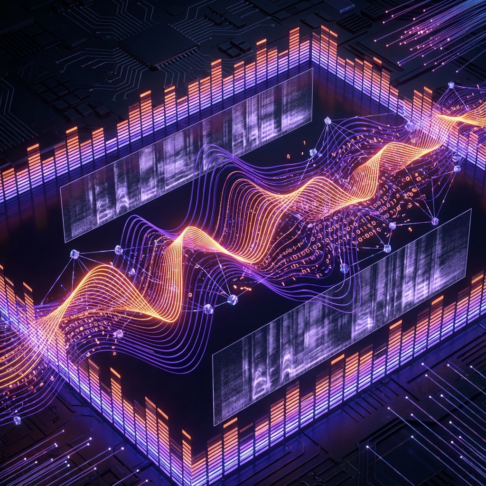
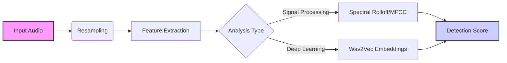

# The Sound of Synthetic: AI Audio Detection



> [!NOTE]
> **Prerequisites:** To run the code in this guide, install the necessary dependencies:
> ```bash
> pip install veridex[audio]
> ```

Voice cloning and text-to-speech (TTS) technologies have advanced rapidly. Models like ElevenLabs can clone a voice with just a few seconds of audio. This poses risks for impersonation and fraud.

This post covers how **Veridex** tackles the challenge of deepfake audio detection.

## 1. The Physics of Sound: Spectral Features

Synthetic audio is generated mathematically, often by vocoders (e.g., HiFi-GAN, WaveGlow). While they sound realistic to the human ear, they often fail to replicate the subtle physical nuances of a human vocal tract.

### The Audio Analysis Pipeline



### Spectral Artifacts
In the high-frequency range, or in the phase information of the signal, generative models often leave traces.
- **Spectral Rolloff:** The frequency below which a specified percentage (usually 85%) of the total spectral energy lies. AI models often struggle to model high-frequency dynamics accurately.
- **MFCCs (Mel-Frequency Cepstral Coefficients):** These represent the short-term power spectrum of sound. They are essentially the "fingerprint" of the timbre.
- **Phase Coherence:** The relationship between different frequency components.

**Veridex**'s `SpectralSignal` looks for these inconsistencies.

```python
from veridex.audio import SpectralSignal

detector = SpectralSignal()
result = detector.detect("path/to/audio.wav")
```

## 2. Foundation Models (Wav2Vec)

Just as we use LLMs to detect AI text, we can use large audio models to detect AI audio. **Wav2Vec 2.0** is a model trained on massive amounts of speech.

We can use the embeddings from Wav2Vec as features to train a classifier or to measure distance from "natural" speech manifolds.

**Veridex**'s `Wav2VecSignal` leverages this powerful model to extract deep features and identify synthetic patterns.

```python
from veridex.audio import Wav2VecSignal

# Downloads the Wav2Vec model automatically
detector = Wav2VecSignal()
result = detector.detect("path/to/audio.wav")

print(f"Fake Probability: {result.score}")
```

## 3. Breathing and Pauses

One surprisingly effective heuristic is breathing. Humans *must* breathe. We take breaths between phrases. Early TTS systems often forgot this, producing endless streams of speech without breath pauses. Newer models add breaths, but often at unnatural intervals or with incorrect acoustic properties.

**Veridex** includes a `BreathingSignal` (experimental) to analyze breath patterns.

## 4. Silence & Pause Analysis

Synthesized speech often has unnatural pause patterns—either too perfect (robotic variance) or non-existent pauses where a human would naturally stop.

**Veridex**'s `SilenceSignal` analyzes the silence ratio and pause duration variance found in the audio file.

```python
from veridex.audio import SilenceSignal

detector = SilenceSignal()
result = detector.detect("path/to/speech.wav")
# Returns score based on silence heuristics
```

## Conclusion

Audio deepfake detection is an arms race. Veridex provides a toolkit of both signal-processing and deep-learning methods to keep you equipped.

Explore the [Audio Detection Notebook](../../examples/notebooks/audio_synthetic_detection.ipynb) to see how to analyze your own audio files.
